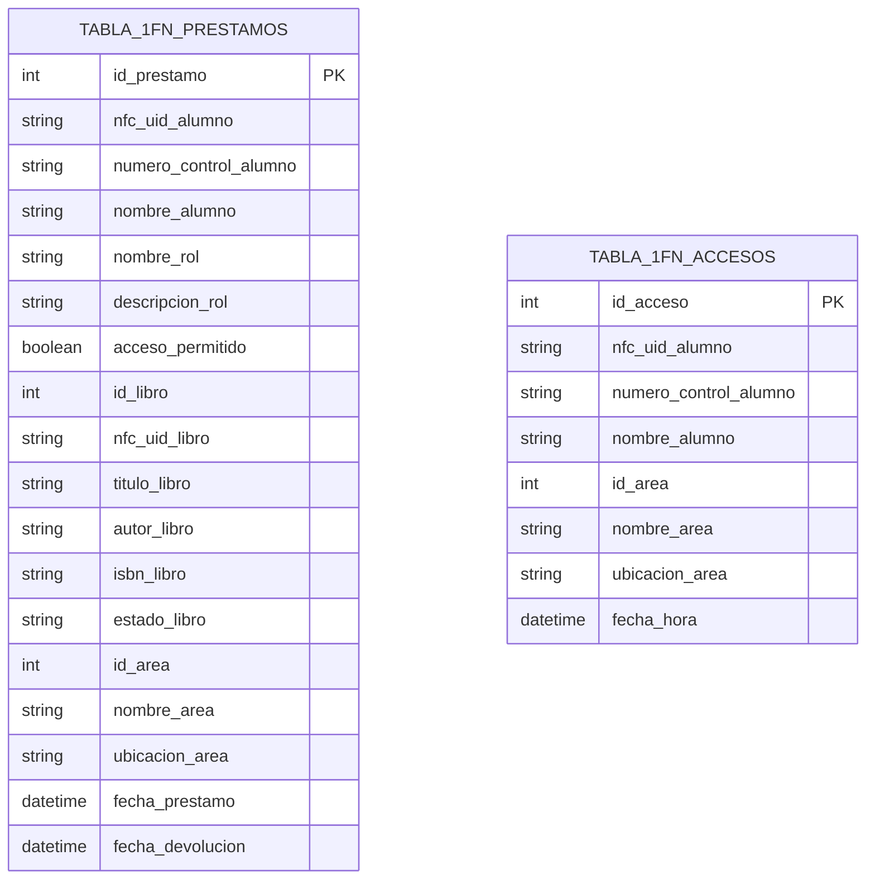
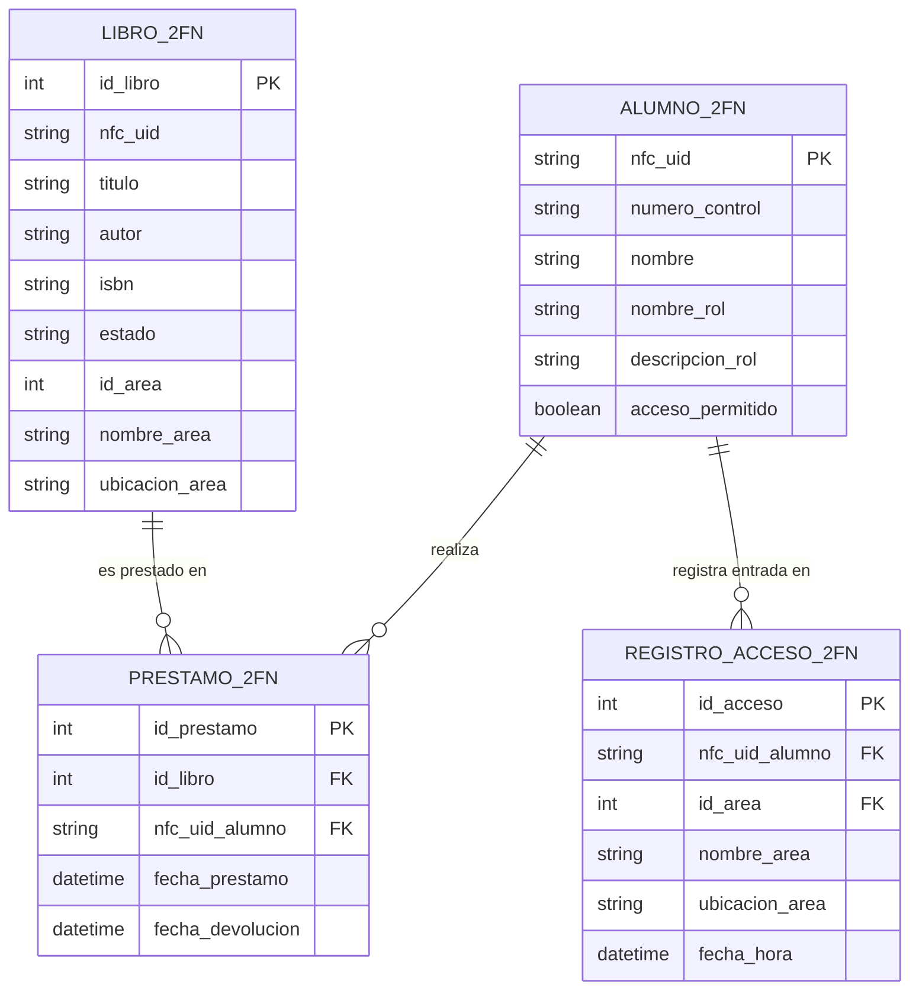
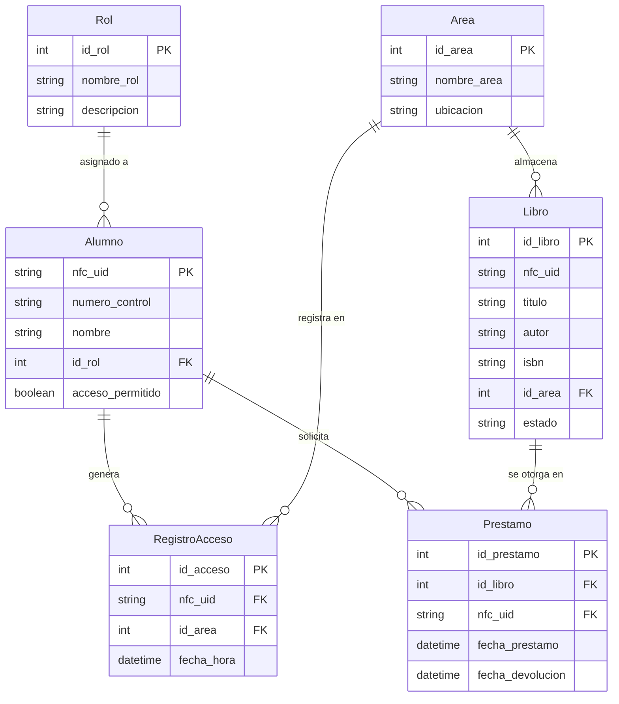

# Diagramas de Normalización de Base de Datos - Proyecto Wall-e (Sistema Gualí Biblioteca)

Este documento detalla el proceso completo de normalización de la base de datos del proyecto **Wall-e / Sistema Gualí Biblioteca** (`web/biblioteca/models.py`), transformando un registro plano no normalizado (0FN) hasta la **Tercera Forma Normal (3FN)**.

---

## 0FN: Estado Inicial No Normalizado (Tabla Plana / Hoja Unificada)

Imaginemos que la información de préstamos, accesos mediante NFC, alumnos, libros, áreas y roles se registrara inicialmente en una única tabla desnormalizada:

### `TABLA_BIBLIOTECA_DESNORMALIZADA` (0FN)
| Atributo | Descripción | Problema |
| :--- | :--- | :--- |
| `id_prestamo` | ID del préstamo | Repetición por cada evento/acceso |
| `nfc_uid_alumno` | UID NFC del Alumno | Redundancia masiva |
| `numero_control` | Matrícula del Alumno | Redundancia masiva |
| `nombre_alumno` | Nombre Completo | Redundancia masiva |
| `nombre_rol` | Nombre del Rol | Redundancia masiva |
| `descripcion_rol` | Descripción del Rol | Dependencia Transitiva |
| `acceso_permitido` | Status de acceso | Redundancia masiva |
| `id_libro` | ID del Libro | Redundancia masiva |
| `nfc_uid_libro` | Tag NFC del Libro | Redundancia masiva |
| `titulo_libro` | Título del Libro | Redundancia masiva |
| `autor_libro` | Autor | Redundancia masiva |
| `isbn_libro` | Código ISBN | Redundancia masiva |
| `estado_libro` | Disponible / Prestado / En Reparación | Redundancia masiva |
| `id_area` | ID del Área | Redundancia masiva |
| `nombre_area` | Nombre del Área | Dependencia Transitiva |
| `ubicacion_area` | Ubicación Física | Dependencia Transitiva |
| `lista_accesos` | `{fecha_hora_1, area_1}, {fecha_hora_2, area_2}` | **Grupo Repetido / No Atómico** |

---

## 1. Primera Forma Normal (1FN)

> **Regla de 1FN:**
> 1. Eliminación de grupos repetidos y atributos compuestos/multivaluados. Todos los valores deben ser **atómicos** (indivisibles).
> 2. Identificación de una Clave Primaria (PK) para cada fila.

### Acciones Aplicadas:
- Se desglosa el grupo repetido `lista_accesos` en registros independientes con valores atómicos.
- Se crean claves primarias para identificar cada registro de manera unívoca.

### Diagrama ER - Primera Forma Normal (1FN)

> [!WARNING]
> **Problemas residuales en 1FN:**
> - **Redundancia masiva**: Si un alumno realiza 10 préstamos, sus datos personales (`nombre`, `numero_control`, `nombre_rol`, `descripcion_rol`) se repiten 10 veces.
> - **Dependencias Parciales y Transitivas**: Los datos del libro o alumno no dependen del préstamo en sí, sino únicamente del `id_libro` o del `nfc_uid_alumno`.

---

## 2. Segunda Forma Normal (2FN)

> **Regla de 2FN:**
> 1. Estar en **1FN**.
> 2. **Eliminar Dependencias Parciales**: Todos los atributos no clave deben depender funcionalmente de la **clave primaria completa**.

### Análisis de Dependencias Funcionales:
- `id_prestamo` $\rightarrow$ `id_libro`, `nfc_uid_alumno`, `fecha_prestamo`, `fecha_devolucion`
- `nfc_uid_alumno` $\rightarrow$ `numero_control`, `nombre`, `nombre_rol`, `descripcion_rol`, `acceso_permitido`
- `id_libro` $\rightarrow$ `nfc_uid_libro`, `titulo`, `autor`, `isbn`, `estado`, `id_area`, `nombre_area`, `ubicacion_area`
- `id_acceso` $\rightarrow$ `nfc_uid_alumno`, `id_area`, `fecha_hora`

### Acciones Aplicadas:
- Se dividen las tablas para separar las entidades independientes (`ALUMNO_2FN`, `LIBRO_2FN`) de las tablas transaccionales (`PRESTAMO_2FN`, `REGISTRO_ACCESO_2FN`).

### Diagrama ER - Segunda Forma Normal (2FN)

> [!NOTE]
> **Mejora en 2FN:** Se eliminaron las dependencias parciales. Los datos del alumno ya no se duplican por cada préstamo.
> **Problema pendiente:** Aún existen **dependencias transitivas**:
> - En `ALUMNO_2FN`: `nfc_uid` $\rightarrow$ `nombre_rol` $\rightarrow$ `descripcion_rol` (La descripción depende del nombre del rol, no directamente del alumno).
> - En `LIBRO_2FN` y `REGISTRO_ACCESO_2FN`: `id_libro` $\rightarrow$ `id_area` $\rightarrow$ `nombre_area`, `ubicacion_area` (El nombre y ubicación del área dependen de `id_area`, no del libro o del registro).

---

## 3. Tercera Forma Normal (3FN)

> **Regla de 3FN:**
> 1. Estar en **2FN**.
> 2. **Eliminar Dependencias Transitivas**: Ningún atributo no clave debe depender de otro atributo no clave. Todos los atributos deben depender **única y directamente de la clave primaria**.

### Acciones Aplicadas:
1. **Extracción de la entidad `Rol`**: Se separa `nombre_rol` y `descripcion` en una tabla `Rol` (`id_rol` PK). En `Alumno` solo se almacena la Foreign Key `id_rol`.
2. **Extracción de la entidad `Area`**: Se separa `nombre_area` y `ubicacion` en una tabla `Area` (`id_area` PK). En `Libro` y `RegistroAcceso` solo se almacena la Foreign Key `id_area`.

### Diagrama ER - Tercera Forma Normal (3FN) - Arquitectura Final del Proyecto Wall-e

---

## Resumen Comparativo de la Normalización

| Forma Normal | Estado del Esquema | Principal Logro Alcanzado |
| :--- | :--- | :--- |
| **0FN** | 1 Tabla Monolítica con grupos repetidos | Ninguno (Datos crudos en hoja desnormalizada) |
| **1FN** | 2 Tablas desglose con datos atómicos | **Atomicidad de datos** (eliminación de arreglos/listas por celda) |
| **2FN** | 4 Tablas separadas por entidades principales | **Eliminación de dependencias parciales** (alumnos y libros independientes de transacciones) |
| **3FN (Proyecto)** | 6 Tablas completamente normalizadas (`models.py`) | **Eliminación de dependencias transitivas** (roles y áreas desacoplados) |

---

## Beneficios Directos para el Proyecto Wall-e

1. **Integridad Referencial**: Si se modifica la ubicación de un área (ej: *"Planta Alta - Estante B"*), solo se cambia **una única fila** en `Area`. No hay riesgo de inconsistencias en libros o accesos.
2. **Eficiencia en Lecturas NFC**: Al escanear una tarjeta o libro NFC con el ESP32, el sistema solo procesa el UID (`nfc_uid` o `id_libro`) de forma ligera y consulta las relaciones en 3FN de forma indexada.
3. **Escalabilidad**: Es posible añadir nuevos atributos a `Rol` o `Area` sin modificar las tablas de `Alumno`, `Libro` o `Prestamo`.
